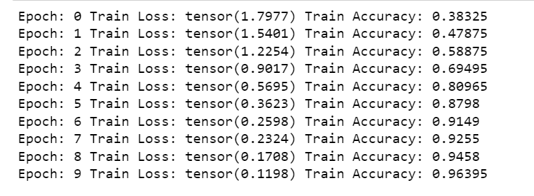
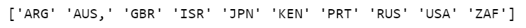
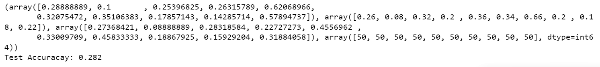

# geoguess-ml

# Intro
In our increasingly online society, it can be difficult to discern between reality and misinformation; posts containing fake news on popular social media sites such as Twitter and Facebook have the potential to cause widespread panic. A potential area in which this fake news manifests is in images, as individuals or organizations who want to spread misinformation can use a particular image and caption it incorrectly to completely change the context of the image. This is an area where image-based geo-localization can make a difference. Image-based geo-localization is the ability to determine the geographic position of where a particular picture is taken solely based on the pixels provided in the image. Due to its importance and potential uses, image-based geo-localization has been a field of growing interest for some time. In 2016, Google developed an AI called Planet which aimed to recognize the location of a photo anywhere in the world; however, due to the vastness of the data, the Google Planet AI could only detect location with a country-accuracy of 28% (Brokaw). More recently, researchers at the University of Siena in Italy used convolutional neural networks to determine which country an image is from, and achieved accuracies of over 50% (Alamayreh); however, the focus of this project was limited to urban centers. Our team believes that we can use convolutional neural networks in a more general sense, and develop a reasonably accurate predictive model that can classify randomly sampled pictures from anywhere in a particular country.
# Motivation/Problem Definition
The motivation of this project is being able to geotag images without any additional information other than the pixels in the image. Our goal for our model was to obtain a dataset containing images from ten countries around the world, and be able to predict which of the ten countries was being displayed in a given image. For our predictive metrics, we calculated the precision, recall, F1-score, and overall accuracy. Our goal is to create a model that has a high rate of true-positives compared to false-positives (precision), as well as a high rate of true-positives compared to false-negatives (recall). Overall accuracy will be defined as the total percentage of correct predictions made. We believe that our model will be fairly accurate for smaller countries, as there would be more homogenous geographical features, whereas larger countries' geographical diversity could hinder the model's performance.
# Data Collection Methods
We utilized the Google StreetView API to generate 20,000 street images from a selection of ten countries. Specifically, we got 2,000 images from each of the United States, Russia, Great Britain, South Africa, Argentina, Japan, Australia, Portugal, Israel, and Kenya. Our intention with this selection of countries was to have enough geographic diversity to train the model on various features/characteristics across the world, while also maintaining some countries with similar features (e.g. South Africa and Kenya) to examine how accurately the model differentiated between these countries. While it is difficult to get StreetView data from an individual country directly, we were able to use the country's latitude and longitude bounds to reduce the areas where the API had to search, and verify data about each image we recieved in this range to ensure it was in our intended country. Using this, we were able to obtain a clean dataset that we could use to implement our model. Shown below are two of our images, from Kenya and Japan respectively.

# Algorithms and Methods
We utilized a convolutional neural network (CNN) as the main model for our project. Because we are using a deep learning architecture, we focused on making modifications to the hyperparameters as well as the number and type of layers in order to see how these modifications affected our results.

## Initial Model
For dimensionality reduction, we used the PCA algorithm from the scikit-learn module, and reduced the number of features present to 20 for every image, after which we used a pandas dataframe to store all of the image vectors and the actual values.  We then input the modified image data into a CNN implemented through PyTorch libraries and packages. Our forward pass algorithm sends the data through three 2-D convolutional layers and three linear layers. Within these layers, we use the rectified linear unit function (ReLU); the advantage of this is that it allows for zero values and is a linear function, allowing for a faster, more sparse representation of data than would be used in a sigmoid function. After using ReLU on the convolution layers, we use max pooling, which down-samples images by applying a max filter to every 2 x 2 nonoverlapping submatrix. After the forward pass, we set the back propogation algorithm to use the Adam optimizer. 

*Similar CNN Architecture*   [source](https://developersbreach.com/convolution-neural-network-deep-learning/)

## Modified Model
We modified our neural network to examine how adding an additional layer would affect the performance of our neural network. We first modified the number of in and out connections of our neural network, and then added a convolutional, batch normalization, and ReLU layer. We wanted to examine if the addition of this layer would improve classification or cause overfitting.

# Results and Discussion
## Initial Model
Before training the model, we performed feature reduction by applying PCA to keep the 20 most relevant features for each image. By running PCA in this manner, we were able to maintain about 91% retained variance. After running PCA, we trained the model over 10 epochs and received a training accuracy of 96% for the final epoch.

Once the model was trained, we tested the model with a total of 500 images and received a testing accuracy of 28.2%.

We also analyzed the predictive performance of each feature by calculating the precision, recall, and F1-score for each country, which is shown in the first three float arrays shown above. The F1-score can be better visualized using the bar graph below:

Our metrics indicate a high predictive performance for Japan, South Africa, and Portugal while indicating a low predictive performance for Australia, United States, and Russia. These results are expected, as Japan, South Africa, and Portugal are smaller countries which led to more similar images being collected. On the other hand, Australia, United States, and Russia are larger countries leading to less similar images being collected.

## Modification of Hyperparameters
We modified various hyperparameters and made several slight changes in our initial model.
1. Leaky ReLU instead of ReLU 
We modified our initial model by applying the leaky ReLU activation function instead of regular ReLU. The primary reason to apply leaky ReLU is to fix what is known as "dying ReLU", which means that a ReLU function outputs mostly zero values, essentially killing the neuron. Leaky ReLU, however, allows for some negative values to "leak" instead of mapping all negative values to zero. We achieved a slightly higher accuracy of 28.4%, although this could be due to the randomness of test selection.
2. Increasing Learning Rate 
We changed our learning rate fro 0.001 to 0.005; this allowed for our model to train faster, but the end result was not as optimal, as we recieved an accuracy of 25.4%.
3. Stochastic Gradient Descent Instead of Adam 
We modified the optimizer. Adam is a commonly used optimizer algorithm for deep learning models due to its speed of convergence and reliability in reaching a global minimum; however, if the parameters are not properly fine-tuned, Adam is sometimes less effective than traditional gradient descent algorithms, specifically Stochastic Gradient Descent (SGD) when it comes to accuracy. Ultimately, we achieved an accuracy of 28.2%, the same as our initial model.

## Modified Model
We applied PCA to keep the 20 most relevant components, and trained the modified model over ten epochs. After training the model, we tested with 500 images and recieved a testing accuracy of 32%. The precision, recall, and F1-scores are shown below: 

 
Note that there is a slightly better performance for overall accuracy/most countries' F1-score, with the exceptions of Great Britain and Australia, which the new model performed worse on.
 
 
We can examine this result using the above shown confusion matrix. We conclude that smaller countries, such as Japan and Portugal, as well as countries with more unique geographical features in the group, such as Kenya, have less false negatives than larger countries such as Australia and the United States. Australia and the United States performed especially poorly; this could be due to the fact that the vast majority of our StreetView images were from rural areas, and the diversity in the geographies of the United States and Australia reduced the model's accuracy for thost two countries. 

## Modified Model with Dropout Layer
We used the modified model and tried to improve performance by adding a dropout layer, which randomly sets some input units to zero with the purpose of preventing overfitting. We tested with 500 images and recieved a testing accuracy of 34.8%, which is our highest accuracy out of all of our models. The precision, recall, F1-scores, and confusion matrix are shown below, where the columns of the confusion matrix are the predicted values, and the rows are the actual values.
 

 
There were general improvements for almost every country, likely because the dropout layer helps reduce issues associated with overfitting. While the United States performed much better, Australia continued to perform very poorly. It seems that we would need a significantly larger dataset to improve accuracy for Australia; we were not able to do so for this particular project due to the limitations posed by the amount of StreetView API images we can access per month.

# Conclusions and Discussion
Overall, we optimized our CNN by adding additional layers, as well as adding a dropout layer to reduce overfitting. This final model gave us an accuracy of almost 35%, and had the best overall precision, recall, and F1-score out of all of the models, indicating superior overall performance. 
In respect to general improvements, a couple of additions could be made to improve model performance. First is the addition of one (or more) fully connected layers. Most modern neural network architectures have fully connected layers, because certain important functions such as XOR cannot be modeled in a single layer. In order to effectively model these types of more complex functions, we could have added another fully connected layer. Another modification we could have made is to increase the number of features from 20 to a greater number (like 50) and examine the effect of retaining more variance. For us, both of these methods had limitations in the significant computational power that would be necessary to achieve them, but they may be useful in formulating better predictions. 
It would be interesting to investigate the effects of our model in urban or suburban environments, as most of our data came from rural areas and thus the main features were geographic; with more urban environments, architecture, people, vehicles, and other such items enter the picture.
# References
 1. Brokaw, Alex. “Google's Latest AI Doesn't Need Geotags to Figure out a Photo's Location.” The Verge, The Verge, 25 Feb. 2016, https://www.theverge.com/2016/2/25/11112594/google-new-deep-learning-image-location-planet. 

2. Nguyen, Q. C., Huang, Y., Kumar, A., Duan, H., Keralis, J. M., Dwivedi, P., Meng, H.-W., Brunisholz, K. D., Jay, J., Javanmardi, M., &amp; Tasdizen, T. (2020, September 1). Using 164 million google street view images to derive built environment predictors of COVID-19 cases. MDPI. Retrieved October 7, 2022, from https://www.mdpi.com/1660-4601/17/17/6359    
3. Popa, Bogdan. “Music Video Created with Google Maps Street View Images Is Surprisingly Cool.” Autoevolution, 16 May 2020, https://www.autoevolution.com/news/music-video-created-with-google-maps-street-view-images-is-surprisingly-cool-143752.html#agal_0. 
4. Theethira, Nirvan S. “GEOGUESSR AI: IMAGE BASED GEO-LOCATION.” GEOGUESSR AI, Mar. 2020, https://nirvan66.github.io/geoguessr.html. 
5. Alamyreh, O., et al. (2022, September 2). Which country is this picture from? New data and methods for DNN-based country recognition. https://doi.org/10.48550/arXiv.2209.02429.
# Gantt Chart (Including Contribution Table)
[GanttChartFinal.xlsx](GanttChartFinal.xlsx)

